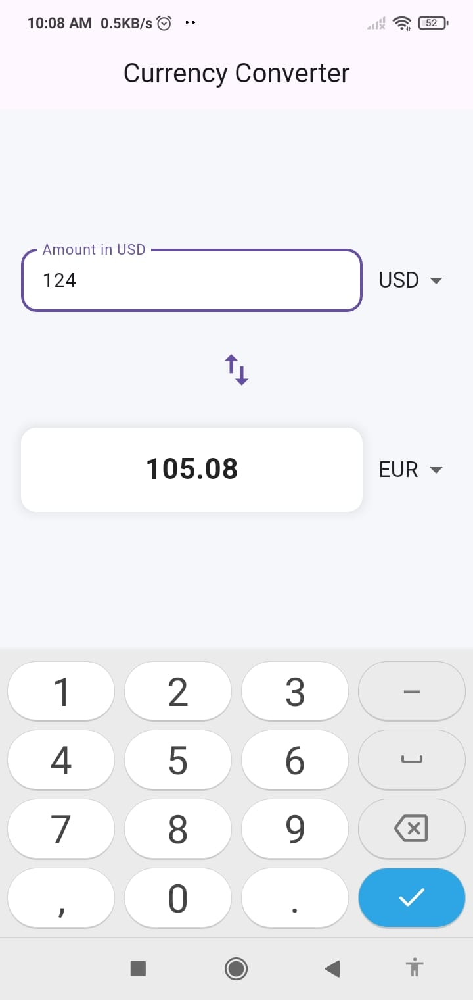

# Currency Converter App

A simple Flutter application that allows users to convert currency between a predefined set of currencies using fixed exchange rates.

## Features

- Input an amount in the source currency.
- Select the source and target currencies from dropdown menus.
- View the converted amount in the target currency.
- Swap the source and target currencies with a single button tap.

